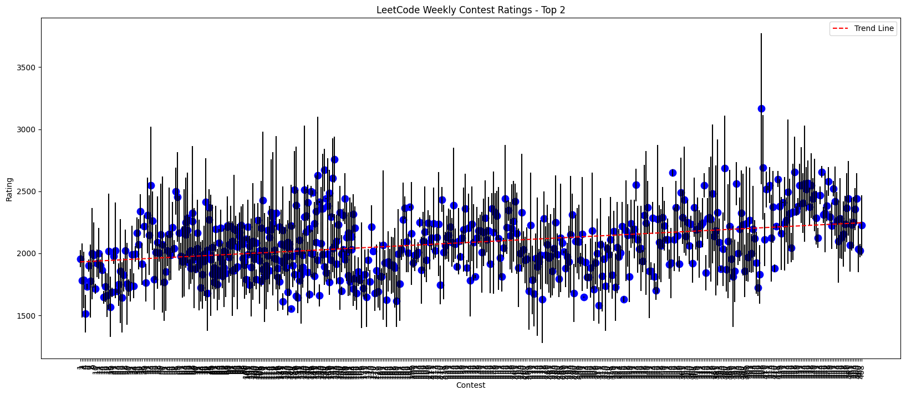
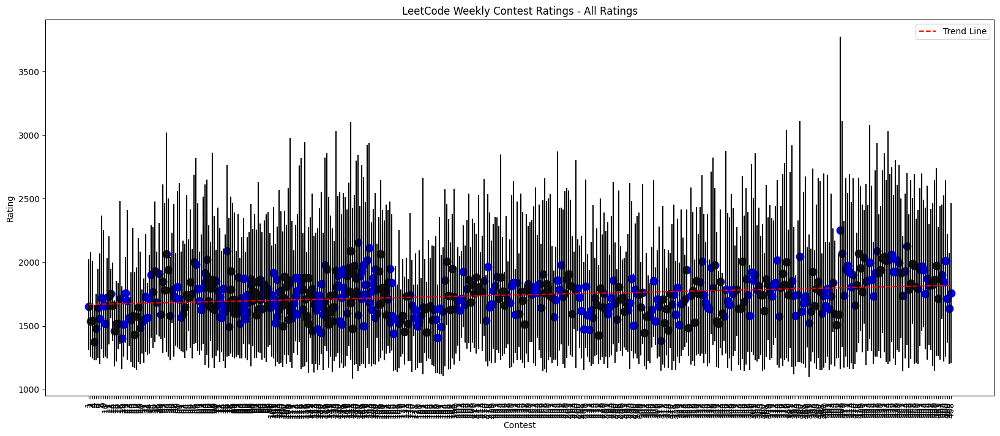
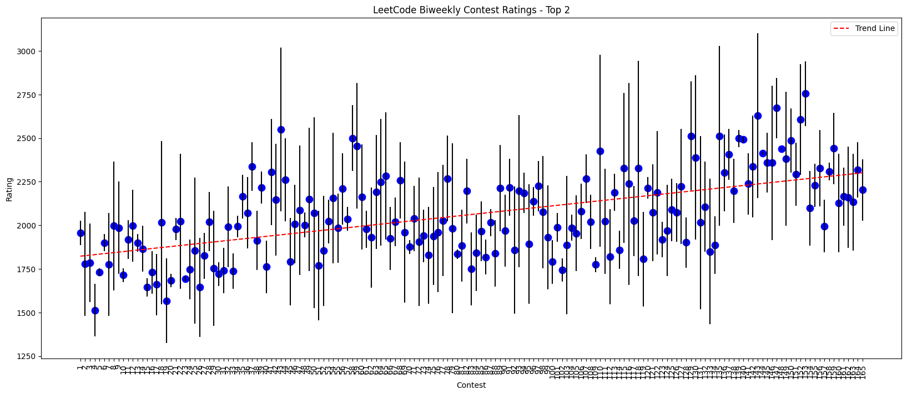
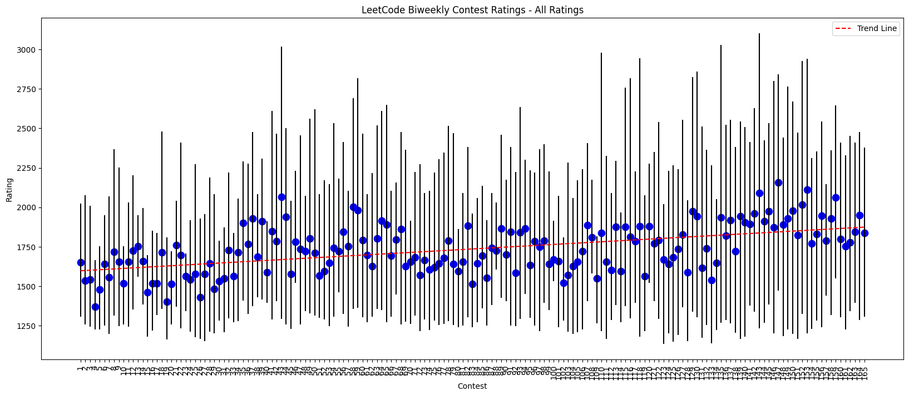

# LeetCode Contest Ratings Visualization

This project generates and updates visualizations of LeetCode contest problem ratings. It processes data from LeetCode's problem ratings and creates candlestick charts for both weekly and biweekly contests, showcasing the minimum, maximum, and mean ratings.

## Generated Diagrams

Below are the latest visualizations of the contest ratings:

### Weekly Contest Ratings - Top 2 Hardest Problems

### Weekly Contest Ratings - All Problems

### Biweekly Contest Ratings - Top 2 Hardest Problems

### Biweekly Contest Ratings - All Problems

These charts are automatically updated approximately once a month using GitHub Actions.

## Data Source

The problem ratings data is sourced from the [zerotrac/leetcode_problem_rating](https://github.com/zerotrac/leetcode_problem_rating) repository.

## License

This project is licensed under the MIT License.